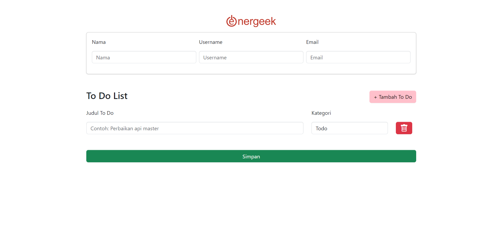
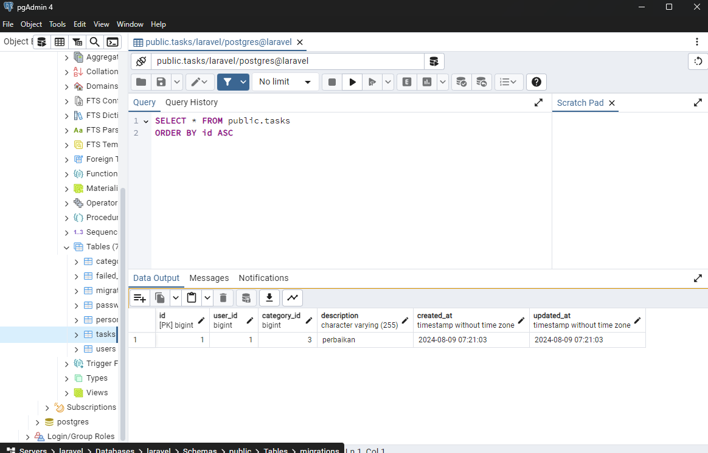

# Todo List Application




This is a simple **Todo List** application built using **Laravel** and **Postgre**. The application allows users to create and manage their tasks, organized into different categories.

## 🌟 Features

- 🔑 **User management**: Automatic creation based on email.
- 📋 **Task management**: Easily add, edit, and delete tasks.
- 🗂️ **Category management**: Organize tasks into categories.
- ⚡ **AJAX-based**: Task submission with a success modal.
- 📱 **Responsive design**: Built with Bootstrap for mobile and desktop.

## 🛠️ Requirements

- PHP >= 7.3
- Composer
- Laravel 8.x
- Postgre

## 🚀 Installation

1. **Clone the repository, Install dependencies, and Set up the environment**:
   
   ```bash
   git clone https://github.com/yourusername/todo-list.git
   cd todo-list
   composer install
   cp .env.example .env

After copying the .env file, configure it to match your environment settings:

2. **Generate application key**:
   ```bash 
   php artisan key:generate

3. **Migrate the database**:
    ```bash
    php artisan migrate

4. **Install dependencies**:
   ```bash
   NPM install
4. **Install dependencies**:
   ```bash
   NPM install

4. **Running the Application**:
   ```bash
   PHP artisan serve

## 🧪 Testing

- php artisan test

## 🛠️ Troubleshooting

- Error 500 Internal Server Error: Check that your .env file is correctly configured and that your database connection is working.
- CSRF Token Mismatch: Ensure that the CSRF token is properly included in your forms and that you're using AJAX with proper headers.